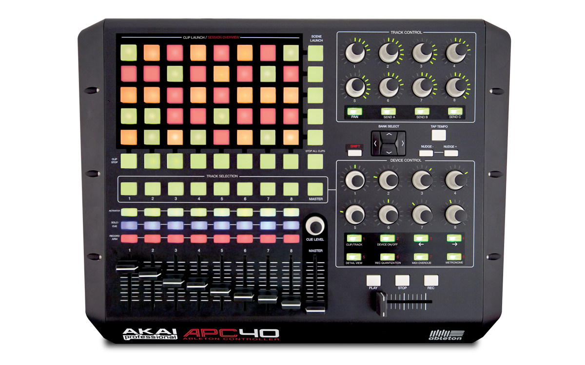
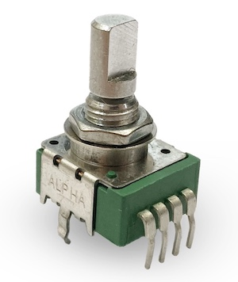
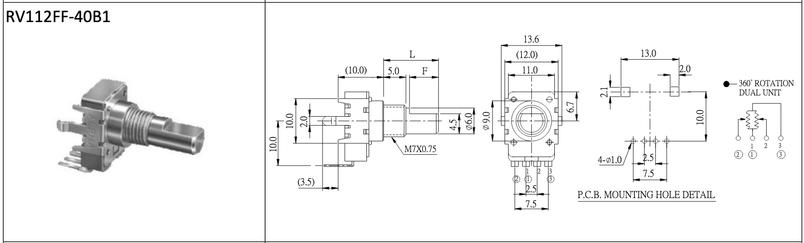
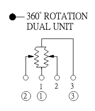
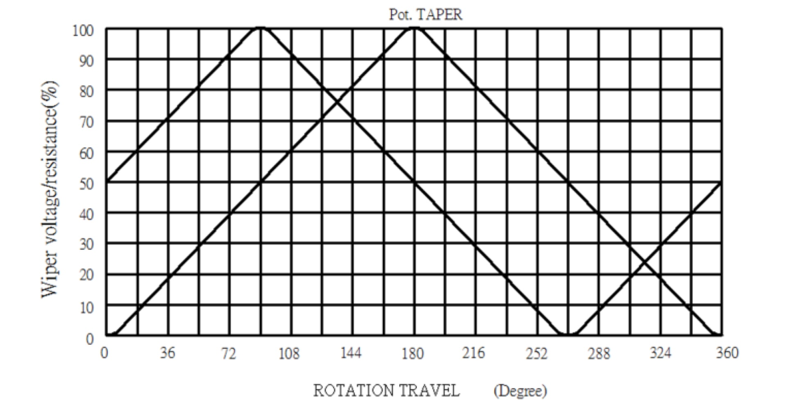

# Endless Pots

**The secret 360º endless-potentiometers that  make rotary encoders obsolete**

*Wait a minute...! There are endlessly rotating pots? But how does that work and why didn't I (nor the internet) know about them?*

We recently stumbled across the existence of endless pots, analog rotary potentiometers that can be turned not just once, but an infinite number of times. These can be used to read out the absolute position (and thus also relative angle changes over time) with high accuracy (analog read out).
And no, we don't mean rotary encoders, which usually have a poor operating feel and can only measure rotation digitally and in discrete steps. 

When we realized that the internet seems to have a blind spot to this topic, we decided to share our researched knowledge so that everyone can ~~throw away their stupid rotary encoders~~ start using endless pots in their devices. :)

# Documentation

*This article will assume you understand the basics of using* [*normal potentiometers*](https://en.wikipedia.org/wiki/Potentiometer) *with a single wiper, and that you have experience programming Arduinos.*

### Prelude by Connor

**I recently embarked on an Arduino project** that required rotary encoders – or so I thought. And I wasn’t so happy about it, because I *really* dislike rotary encoders. The affordable ones have click-steps and are usually limited to 20-30 steps – unless you want to dish out some serious cash – and even then, they’re bulky, harder to program, and nearly impossible to multiplex. 

While trying to find non-shitty encoders, a thought popped into my mind… “Didn’t I used to have a MIDI controller with like, *16 smooth encoders?!”* 

Ah yes, the **APC40 mk1**! Sure enough, it has 16 damn encoders with LED rings! And even with an 8x5 clip launcher, tons of buttons, 9 faders and a cross-fader, it was still relatively affordable. So, where can I get these magically cheap, perfectly smooth encoders?!

This question sent me down one of the deepest internet rabbit-holes I’ve ever been on. And odds are, if you’re reading this now, you’re in the same position. 

### The Alpha 360º Endless Potentiometer

**The secret is the Alpha 360º Endless Potentiometer with two wipers.** 

Prices can vary a lot (from $1 in special offers to $4.24 on Mouser) and the pots are offered under many different names. We already bought [these](https://de.aliexpress.com/item/1005007005315736.html?spm=a2g0o.order_list.order_list_main.5.4b065c5fZVxfd8&gatewayAdapt=glo2deu) (which recently just jumped up in price???) and [these](https://de.aliexpress.com/item/1005007005688361.html) and can confirm they work properly and have good turning resistance. 

They almost certainly are the [RV112FF-40B1 model](https://www.taiwanalpha.com/downloads?target=products&id=79), but we can't say for sure as they are sold under different names. Very often they are sold with terms like "Alpha Boss GT10", "MPK, MPD, APC rotary pot", etc. to show that they can be used as replacement parts for these products.

We also bought [some of this other model](https://www.taiwanalpha.com/downloads?target=products&id=93) from Mouser, which are the same, but also include a push-switch, so you can click the knob in like a button. However, the turning-resistance on these is very weak, which makes them feel much cheaper than the non-switch model. As it is pretty cool to have the push function, we are working on solutions to artificially add torque by e.g. sticking foam to the pot caps… It's a work in progress.

### Pins

Unlike normal potentiometers, these 360º pots have *4 pins* for the wipers. Two of them are ground and voltage like a normal pot, but instead of having just one pin for the analog read out, there are *two*. This is because there are two wipers (variable resistors), which are offset from each other. Using the analog data you get from both pins, you can find the absolute position of the knob in radians.

Pins ① and ③ are ground and voltage, and pins ② and 2 are analog data. You’ll have to experiment until you get them in the correct direction.

### Signal Path of the Wipers

Getting the aboslute position from the two analog read pins isn't as easy as it may seem. We provide a basic Arduino script that can read any number of these pots (two pots in the example) and report their absolute values as MIDI or Serial. The key is the [2-argument arctangent function](https://en.wikipedia.org/wiki/Atan2), aka **atan2**. Using this with the values from both wipers gives you the position of the knob from -pi to +pi. 

The second example we provide is a generic PCB with 8 of these pots connected to ADCs. They read the wipers and pass the values on to an ESP32, where a similar calculation is done to get the angle change since the last cycle. This can then be sent via Serial (or other protocols) to a computer to only trigger relative changes on a parameter...

## Links and Sources

When we started researching this topic, we couldn't really find a source. This was partly because we used the wrong terms. We went back and collected all the forums and discussions on the topic when we were preparing this repo. Here are the most important ones (unorganized, maybe we'll do that later). Some of them already contain the right clues if you look closely ;-) Many thanks for the work of others so far! 

- [components - Is there something such as an infinite potentiometer? - Electrical Engineering Stack Exchange](https://electronics.stackexchange.com/questions/374040/is-there-something-such-as-an-infinite-potentiometer) 
- [Driver/algorithm for 360 deg endless potentiometer | Hackaday.io](https://hackaday.io/project/171841-driveralgorithm-for-360-deg-endless-potentiometer) 
- [Convert dual pot "360 endless pot" to angle position](https://gist.github.com/todbot/cd964282dd3c2599a629f5ecf5d1ca98) 
- [Endless potentiometer decoding - Software Development - Daisy Forums](https://forum.electro-smith.com/t/endless-potentiometer-decoding/3972) 
- [GeroTakke.de - ottopot](https://gerotakke.de/ottopot/)
- [help endless potentiometers](https://www.xsimulator.net/community/threads/help-endless-potentiometers.12218/)  
- [Read Endless Potentiometer | Teensy Forum](https://forum.pjrc.com/index.php?threads/read-endless-potentiometer.59830/) 
