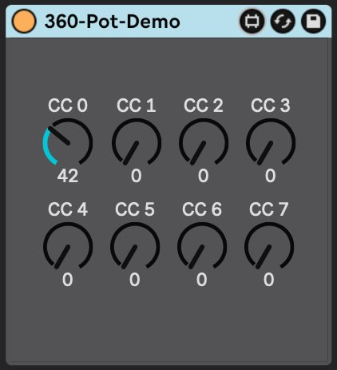

This Arduino Code uses 4 analog input pins of a Aduino board (e.g. Arduino Uno) to read out the two wipers of **two endles pots** and sends the position to ableton using MIDI and a receiving Max for Live patch. Key (as previously described) is the [2-argument arctangent function](https://en.wikipedia.org/wiki/Atan2), aka **atan2** to get the absolute position by using the values of two wipers.

## The Arduino Code

This Arduino code simply returns the absolute position of the potentiometer as a MIDI CC value (or Serial), scaled from 0-127. Additionally, if you send a value with the same MIDI CC number back to the Arduino controller, it will update the zero-point with that new value. 

### Example

> *I turn the first potentiometer on the controller (CC 0) and see the value updating on the computer. I stop, and the value is currently 70. Then, on the computer, with my mouse, I update the same CC 0 value, sending a new value of 42 back to the Arduino controller.*
>
> *From that point on, the current position of the knob on the Arduino controller will be internally updated to 42, so when I turn the potentiometer again, it will start counting up or down from 42. This is the usual expected behavior for MIDI controllers with endless-encoders. You don’t want them to jump back to the old value - that would defeat the purpose of an endless-turn knob!*

## Max for Live Device

I’ve also included a simple Max for Live device (receive_single.amxd) to serve as a demonstration. It will work for CC values 0-7. 

*

The only “special” thing it’s doing is preventing a feedback loop. The incoming values from the controller are not sent back to the controller, but any manual updates to the dials (with the mouse) *are* sent back to the controller. This logic can be replicated in an Ableton Remote Script, or any other software of your choice.

To test it, simply drag the device onto an empty MIDI Track in Ableton with no other effects before or after it. On the MIDI Track Routing, set the input and output to your Arduino controller, and set the Track Monitoring to IN. 

## Hints for the Arduino Code

- On **line 27**, you can set the total number of potentiometers. It’s set to 2 by default.
- On **lines 28 and 29**, you’ll set the pins you use for wipers 1 and 2. Since there are 2 pots, there are two values for each, but if you change the number of pots, you will need to add or remove the number of values accordingly. 
  **Line 28** contains *all of the wiper 1’s* from all of your pots, in ascending order. 
  **Line 29** contains *all of the wiper 2’s* in the same order. 
  So, in my code, wipers 1 and 2 of the first pot are on pins 14 and 16, respectively. For the second pot, it’s pins 15 and 17. Hope that makes sense.
- On **line 37**, you can change the starting CC number. Your pots will step up incrementally from this number. The default is 0. 
- On **line 132**, you’ll find the magical atan2 function. 
- This code uses the libraries **MIDIUSB.h** and **ResponsiveAnalogRead.h**. You’ll need to install those.