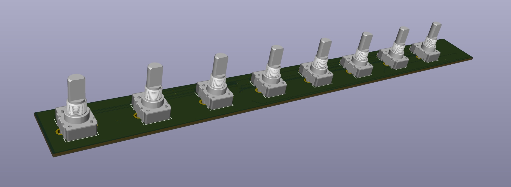

# Generic 8 Channel PCB Design with ESP32

This PCB reads the **relative angle change of 8 endless potentiometers between each cycle**. 

## The Board

In [/kicad](/kicad) you can find a KiCAD schematic and board file. This board however has not been tested yet, but is similar to generic8chPCBwithButtons placed next to this directory, which we sucessfully build and tested (but didn't yet have time to upload, check the license, etc.).

The board uses a [Seeed Studio XIAO ESP32-C3](https://wiki.seeedstudio.com/XIAO_ESP32C3_Getting_Started/) microcontroller to retrieve the sixteen 12-bit analog reads from two [MCP3208](https://www.microchip.com/en-us/product/mcp3208) ADCs via SPI and then sends the calculated angle changes (e.g. to a computer) as one serial message per cycle. Reading and smoothing the values, calculating the position of each knob and sending the whole array takes only about **1 microsecond**. 

This is certainly technical overkill, but with little hardware experience it seemed to be the simplest and most reliable solution to us. Feel free to comment, if you have ideas that make this PCB better.




## The Code

The core of the code is the atan2 function, which receives the two analog measured values of the two wipers of one potentiometer and returns the absolute position of the knob between -pi and +pi. The relative angle change compared to the last reading is calculated from this and sent via the serial interface together with the changes of the other potentiometers.

I am using the Arduino IDE to upload the code. You need to install the ESP32 board in Arduino and the following libraries:

```Arduino
#include <SPI.h>
#include <Mcp320x.h>
#include <ResponsiveAnalogRead.h>
```

