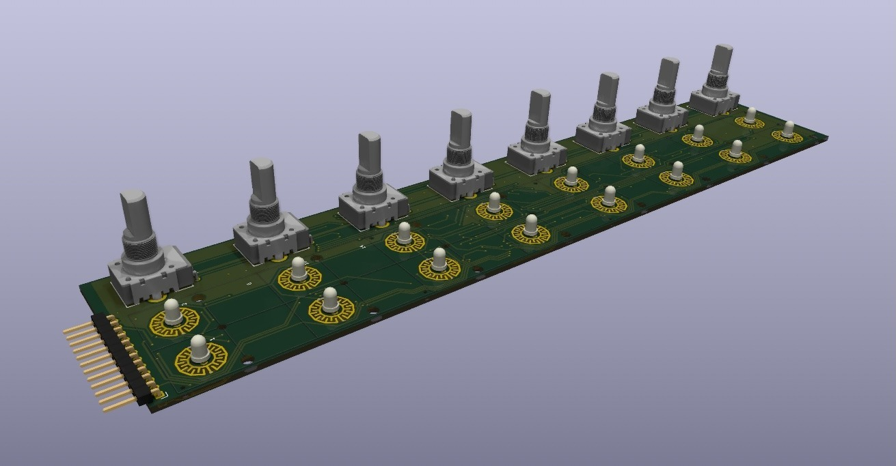
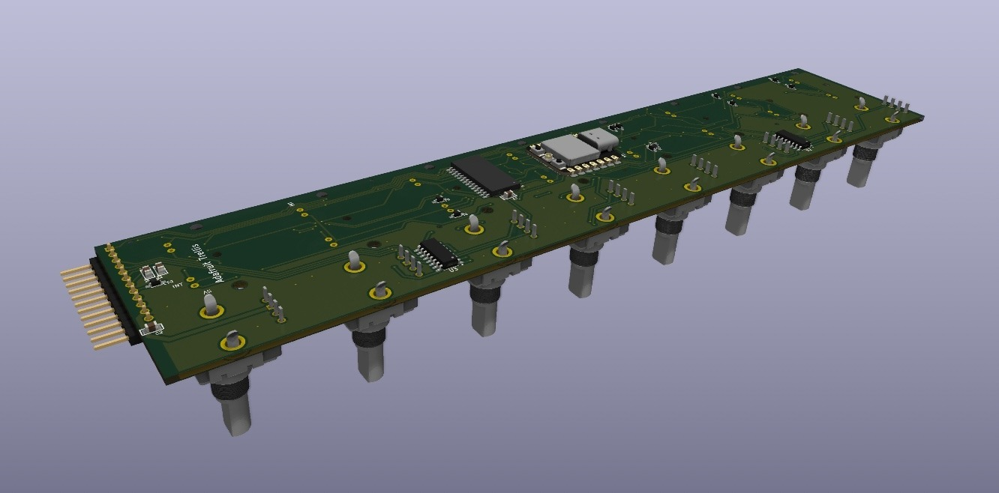
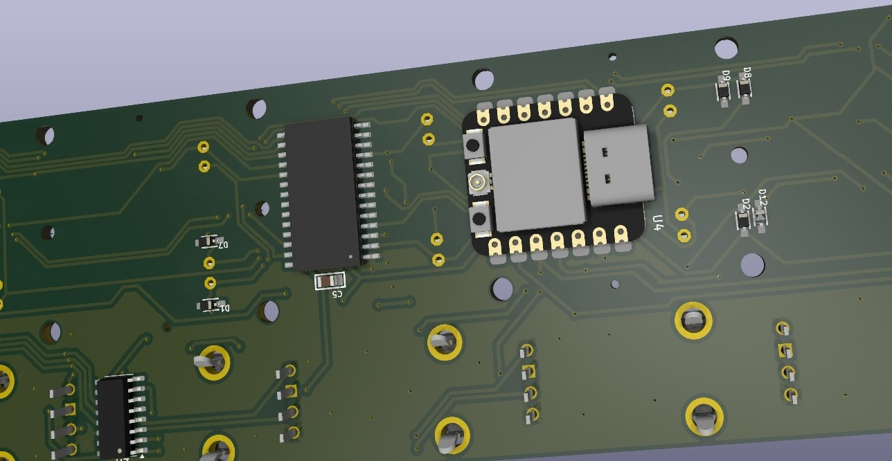
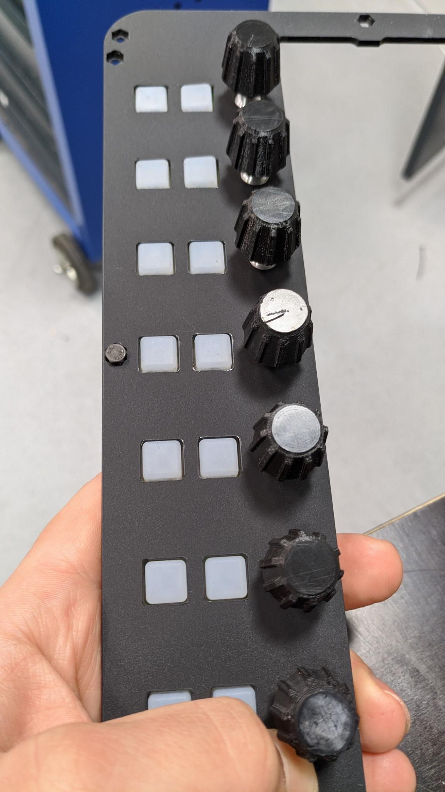

# Generic 8 Channel PCB Design with ESP32 and Additional Silicone Buttons

This is a preview for a version of the generic8chPCB board (located in the directory next to this) with additional 2 buttons next to each pot. We have to fix some programming issues and check license stuff before (the silicon elastomer buttons are taken from the wonderful Adafruit Trellis project).

In addition to the ADCs and the ESP of the generic8chPCB we added a HT16K33 LED controller driver that takes in the buttons and drives the LEDs and is connected to the ESP via i2c.

Some renders of the PCB:

The PCB will be part of a Raspberry Pi driven controller for Ableton (or other DAWs) via OSC/UPD. Here is a preview of the (not finished) project:

